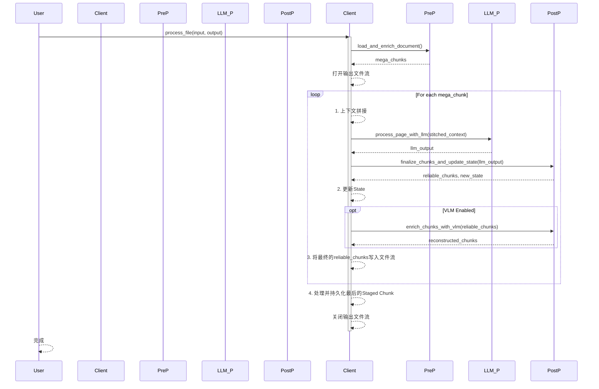

# TextFormer: 设计理念与最终架构

本文档阐述了 `TextFormer` 的核心设计理念、最终实现架构以及关键工作流程，旨在为使用者和二次开发者提供一份准确、清晰的“地图”。

## 1. 核心理念：从“分割器”到“结构化引擎”

`TextFormer` 的诞生源于一个核心洞察：在构建高级RAG系统的过程中，文档处理的瓶颈不仅在于“分割”（Splitting），更在于**“理解与结构化” (Understanding & Structuring)**。

因此，`TextFormer` 的最终使命是：**利用大型语言模型（LLM）和视觉语言模型（VLM），将非结构化或半结构化的多模态文档，转化为一个由大小合理、语义连贯、元数据丰富的“原子块”（Atom Chunks）组成的、可直接用于下游任务的结构化数据流。**

它是一个**结构化**和**富化**的引擎，而非一个简单的分割器。

## 2. 架构原则：关注点分离

在开发过程中，我们确立了`TextFormer`最重要的架构原则：**关注点分离**。我们将复杂的文档处理任务，解耦为了两个独立的阶段：

1.  **文档结构化 (由 `TextFormer` 完成)**: 本项目的核心职责。它专注于理解文档的**结构与形式**（章节、列表、代码、图片等），并将其可靠地分解为`Atom Chunks`，同时为每个块标注其**结构性元数据**（例如，`{"type": "Conclusion", "form": "list"}`）。
2.  **领域知识提取 (未来独立的下游任务)**: 这是一个更高级的流程，它消费`TextFormer`的输出，并利用更丰富的全局上下文来进行深度的、**内容驱动的**领域知识提取（例如，提取所有被提及的技术、项目代号或关键观点）。

这个原则极大地降低了单次LLM调用的认知负荷，是系统稳定性和可靠性的基石。

## 3. 最终数据模型

我们的核心数据模型最终演进为以下形态，以支持流式处理和多模态富化：

```python
# src/data_models.py

class Chunk(BaseModel):
    start_page: int
    start_line: int
    end_page: int
    end_line: int
    summary: str
    metadata: Dict[str, Any] = Field(default_factory=dict)
    heading: Optional[str] = None
    raw_text: Optional[str] = None

class LLMOutput(BaseModel):
    hierarchical_headings: List[str]
    chunks: List[Chunk]

class ProcessingState(BaseModel):
    doc_id: str
    hierarchical_headings: List[str] = Field(default_factory=list)
    metadata_schema: Dict[str, Any] = Field(default_factory=dict)
    staged_chunk: Optional[Chunk] = None
    unprocessed_lines: List[Dict[str, Any]] = Field(default_factory=list)
    processed_lines: Set[str] = Field(default_factory=set)
```

## 4. 最终工作流：流式处理引擎

`TextFormer` 的最终工作流是一个**状态化的、流式的处理引擎**，确保了在处理长文档时的高度鲁棒性和内存效率。

### 4.1 整体流程图

```mermaid
flowchart TD
    A[开始] --> B{加载并预处理文档};
    B --> C[Gross Split & Pre-Enrichment into Mega Chunks];
    C --> D[初始化State (含文件名标题, metadata_schema)];
    D --> E[打开输出文件流];

    E --> F{For each Mega Chunk};
    F -- Yes --> G[1. 上下文拼接<br/>(unprocessed_lines + staged_chunk + current_mega_chunk)];
    G --> H[2. LLM Fine Split<br/>(生成 reliable_chunks, new_staged_chunk, new_unprocessed_lines)];
    H --> I[3. 更新State];
    I --> J[4. VLM Post-Enrichment<br/>(对reliable_chunks进行解构/重构)];
    J --> K[5. 即时持久化<br/>(将最终的reliable_chunks追加写入文件流)];
    K --> F;

    F -- No --> L[处理最后的Staged Chunk];
    L --> M[VLM Post-Enrichment];
    M --> N[持久化最后的Chunk];
    N --> O[关闭输出文件流];
    O --> P[结束];
```

### 4.2 核心模块时序图


