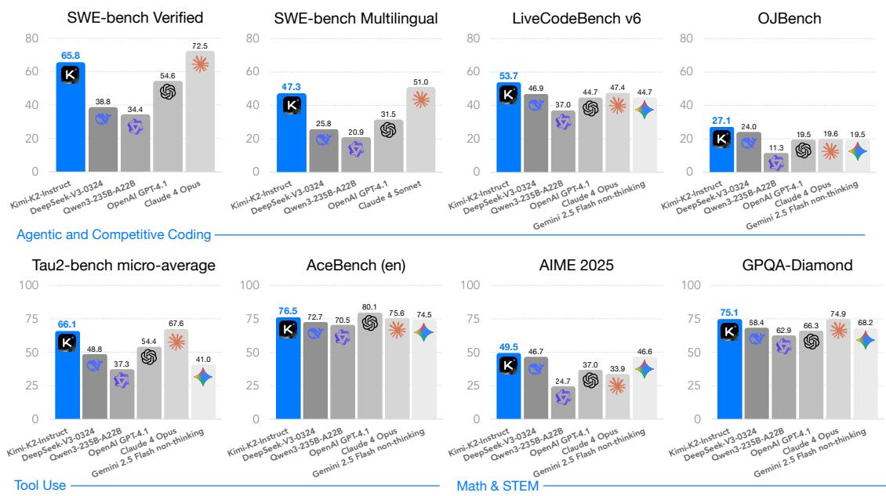
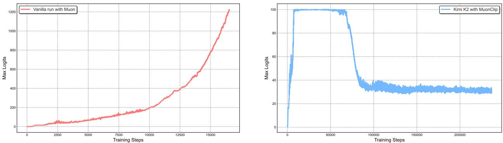
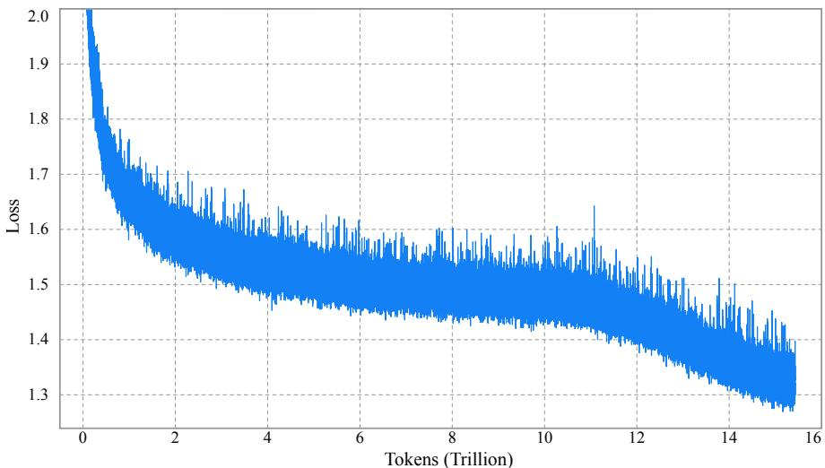

# KIMI K2: OPEN AGENTIC INTELLIGENCE

TECHNICAL REPORT OF KIMI K2

Kimi Team

# ABSTRACT

We introduce Kimi K2, a Mixture- of- Experts (MoE) large language model with 32 billion activated parameters and 1 trillion total parameters. We propose the MuonClip optimizer, which improves upon Muon with a novel QK- clip technique to address training instability while enjoying the advanced token efficiency of Muon. Based on MuonClip, K2 was pre- trained on 15.5 trillion tokens with zero loss spike. During post- training, K2 undergoes a multi- stage post- training process, highlighted by a large- scale agentic data synthesis pipeline and a joint reinforcement learning (RL) stage, where the model improves its capabilities through interactions with real and synthetic environments.

Kimi K2 achieves state- of- the- art performance among open- source non- thinking models, with strengths in agentic capabilities. Notably, K2 obtains 66.1 on Tau2- Bench, 76.5 on ACEBench (En), 65.8 on SWE- Bench Verified, and 47.3 on SWE- Bench Multilingual — surpassing most open and closed- sourced baselines in non- thinking settings. It also exhibits strong capabilities in coding, mathematics, and reasoning tasks, with a score of 53.7 on LiveCodeBench v6, 49.5 on AIME 2025, 75.1 on GPQA- Diamond, and 27.1 on OJBench, all without extended thinking. These results position Kimi K2 as one of the most capable open- source large language models to date, particularly in software engineering and agentic tasks. We release our base and post- trained model checkpoints1 to facilitate future research and applications of agentic intelligence.

  
Figure 1: Kimi K2 main results.2

# 1 Introduction

The development of Large Language Models (LLMs) is undergoing a profound paradigm shift towards Agentic Intelligence - the capabilities for models to autonomously perceive, plan, reason, and act within complex and dynamic environments. This transition marks a departure from static imitation learning towards models that actively learn through interactions, acquire new skills beyond their training distribution, and adapt behavior through experiences [63] It is believed that this approach allows an AI agent to go beyond the limitation of static human- generated data, and acquire superhuman capabilities through its own exploration and exploitation. Agentic intelligence is thus rapidly emerging as a defining capability for the next generation of foundation models, with wide- ranging implications across tool use, software development, and real- world autonomy.

Achieving agentic intelligence introduces challenges in both pre- training and post- training. Pre- training must endow models with broad general- purpose priors under constraints of limited high- quality data, elevating token efficiency- - learning signal per token- - as a critical scaling coefficient. Post- training must transform those priors into actionable behaviors, yet agentic capabilities such as multi- step reasoning, long- term planning, and tool use are rare in natural data and costly to scale. Scalable synthesis of structured, high- quality agentic trajectories, combined with general reinforcement learning (RL) techniques that incorporate preferences and self- critique, are essential to bridge this gap.

In this work, we introduce Kimi K2, a 1.04 trillion- parameter Mixture- of- Experts (MoE) LLM with 32 billion activated parameters, purposefully designed to address the core challenges and push the boundaries of agentic capability. Our contributions span both the pre- training and post- training frontiers:

We present MuonClip, a novel optimizer that integrates the token- efficient Muon algorithm with a stabilityenhancing mechanism called QK- Clip. Using MuonClip, we successfully pre- trained Kimi K2 on 15.5 trillion tokens without a single loss spike. We introduce a large- scale agentic data synthesis pipeline that systematically generates tool- use demonstrations via simulated and real- world environments. This system constructs diverse tools, agents, tasks, and trajectories to create high- fidelity, verifiably correct agentic interactions at scale. We design a general reinforcement learning framework that combines verifiable rewards (RLVR) with a selfcritique rubric reward mechanism. The model learns not only from externally defined tasks but also from evaluating its own outputs, extending alignment from static into open- ended domains.

Kimi K2 demonstrates strong performance across a broad spectrum of agentic and frontier benchmarks. It achieves scores of 66.1 on Tau2- bench, 76.5 on ACEBench (en), 65.8 on SWE- bench Verified, and 47.3 on SWE- bench Multilingual, outperforming most open- and closed- weight baselines under non- thinking evaluation settings, closing the gap with Claude 4 Opus and Sonnet. In coding, mathematics, and broader STEM domains, Kimi K2 achieves 53.7 on LiveCodeBench v6, 27.1 on OJBench, 49.5 on AIME 2025, and 75.1 on GPQA- Diamond, further highlighting its capabilities in general tasks. On the LMSYS Arena leaderboard (July 17, 2025), Kimi K2 ranks as the top 1 open- source model and 5th overall based on over 3,000 user votes.

To spur further progress in Agentic Intelligence, we are open- sourcing our base and post- trained checkpoints, enabling the community to explore, refine, and deploy agentic intelligence at scale.

# 2 Pre-training

2 Pre- trainingThe base model of Kimi K2 is a trillion- parameter mixture- of- experts (MoE) transformer [72] model, pre- trained on 15.5 trillion high- quality tokens. Given the increasingly limited availability of high- quality human data, we posit that token efficiency is emerging as a critical coefficient in the scaling of large language models. To address this, we introduce a suite of pre- training techniques explicitly designed for maximizing token efficiency. Specifically, we employ the token- efficient Muon optimizer [33, 46] and mitigate its training instabilities through the introduction of QK- Clip. Additionally, we incorporate synthetic data generation to further squeeze the intelligence out of available high- quality tokens. The model architecture follows an ultra- sparse MoE with multi- head latent attention (MLA) similar to DeepSeek- V3 [10], derived from empirical scaling law analysis. The underlying infrastructure is built to optimize both training efficiency and research efficiency.

# 2.1 MuonClip: Stable Training with Weight Clipping

2.1 MuonClip: Stable Training with Weight ClippingWe train Kimi K2 using the token- efficient Muon optimizer [33], incorporating weight decay and consistent update RMS scaling [46]. Experiments in our previous work Moonlight [46] show that, under the same compute budget and model size — and therefore the same amount of training data — Muon substantially outperforms AdamW [36, 48], making it an effective choice for improving token efficiency in large language model training.

Training instability when scaling Muon Despite its efficiency, scaling up Muon training reveals a challenge: training instability due to exploding attention logits, an issue that occurs more frequently with Muon but less with AdamW in our experiments. Existing mitigation strategies are insufficient. For instance, logit soft- cap [69] directly clips the attention logits, but the dot products between queries and keys can still grow excessively before capping is applied. On the other hand, Query- Key Normalization (QK- Norm) [11- 81] is not applicable to multi- head latent attention (MLA), because its Key matrices are not fully materialized during inference.

Taming Muon with QK- Clip To address this issue, we propose a novel weight- clipping mechanism  $QK$  Clip to explicitly constrain attention logits. QK- Clip works by rescaling the query and key projection weights post- update to bound the growth of attention logits.

Let the input representation of a transformer layer be  $\mathbf{X}$  . For each attention head  $h$  , its query, key, and value projections are computed as

$$
\mathbf{Q}^h = \mathbf{X}\mathbf{W}_q^h,\quad \mathbf{K}^h = \mathbf{X}\mathbf{W}_k^h,\quad \mathbf{V}^h = \mathbf{X}\mathbf{W}_v^h.
$$

where  $\mathbf{W}_q,\mathbf{W}_k,\mathbf{W}_v$  are model parameters. The attention output is:

$$
\mathbf{O}^h = \mathrm{softmax}\left(\frac{1}{\sqrt{d}}\mathbf{Q}^h\mathbf{K}^{h\top}\right)\mathbf{V}^h.
$$

We define the max logit, a per- head scalar, as the maximum input to softmax in this batch  $B$  ..

$$
S_{\mathrm{max}}^h = \frac{1}{\sqrt{d}}\max_{\mathbf{Q}^h}\max_{i,j}\mathbf{Q}_i^h\mathbf{K}_i^{h\top}
$$

where  $i,j$  are indices of different tokens in a training sample  $\mathbf{X}$

The core idea of QK- Clip is to rescale  $\mathbf{W}_k,\mathbf{W}_q$  whenever  $S_{\mathrm{max}}^h$  exceeds a target threshold  $\tau$  . Importantly, this operation does not alter the forward/backward computation in the current step - - we merely use the max logit as a guiding signal to determine the strength to control the weight growth.

A naive implementation clips all heads at the same time:

$$
\mathbf{W}_q^h\leftarrow \gamma^\alpha \mathbf{W}_q^h\qquad \mathbf{W}_k^h\leftarrow \gamma^{1 - \alpha}\mathbf{W}_k^h
$$

where  $\gamma = \min (1,\tau /S_{\mathrm{max}})$  with  $S_{\mathrm{max}} = \mathrm{max}_hS_{\mathrm{max}}^h$  , and  $\alpha$  is a balancing parameter typically set to 0.5, applying equal scaling to queries and keys.

However, we observe that in practice, only a small subset of heads exhibit exploding logits. In order to minimize our intervention on model training, we determine a per- head scaling factor  $\gamma_{h} = \min (1,\tau /S_{\mathrm{max}}^{h})$  , and opt to apply per- head QK- Clip. Such clipping is straightforward for regular multi- head attention (MHA). For MLA, we apply clipping only on unshared attention head components:

.  $\mathbf{q}^C$  and  $\mathbf{k}^C$  (head- specific components): each scaled by  $\sqrt{\gamma h}$  .  $\mathbf{q}^R$  (head- specific rotary): scaled by  $\gamma_h$ $\mathbf{k}^R$  (shared rotary): left untouched to avoid effect across heads.

MuonClip: The New Optimizer We integrate Muon with weight decay, consistent RMS matching, and QK- Clip into a single optimizer, which we refer to as MuonClip (see Algorithm 1).

We demonstrate the effectiveness of MuonClip from several scaling experiments. First, we train a mid- scale 9B activated and 53B total parameters Mixture- of- Experts (MoE) model using the vanilla Muon. As shown in Figure 2 (Left), we observe that the maximum attention logits quickly exceed a magnitude of 1000, showing that attention logits explosion is already evident in Muon training to this scale. Max logits at this level usually result in instability during training, including significant loss spikes and occasional divergence.

# Algorithm 1 MuonClip Optimizer

1: for each training step  $t$  do 2: // 1. Muon optimizer step 3: for each weight  $\mathbf{W}\in \mathbb{R}^{n\times m}$  do 4:  $\mathbf{M}_t = \mu \mathbf{M}_{t - 1} + \mathbf{G}_t$ $\triangleright \mathbf{M}_0 = \mathbf{0}$ $\mathbf{G}_t$  is the grad of  $\mathbf{W}_t$ $\mu$  is momentum 5:  $\mathbf{O}_t =$  Newton- Schulz  $(\mathbf{M}_t)\cdot \sqrt{\max (n,m)}\cdot 0.2$ $\gimel$  Match Adam RMS 6:  $\mathbf{W}_t = \mathbf{W}_{t - 1} - \eta (\mathbf{O}_t + \lambda \mathbf{W}_{t - 1})$ $\vartriangleright$  learning rate  $\eta$  , weight decay  $\lambda$  7: end for 8: // 2. QK- Clip 9: for each attention head  $h$  in every attention layer of the model do 10: Obtain  $S_{\mathrm{max}}^{h}$  already computed during forward 11: if  $S_{\mathrm{max}}^{h} > \tau$  then 12:  $\gamma \leftarrow \tau /S_{\mathrm{max}}^{h}$  13:  $\mathbf{W}_{qc}^{h}\leftarrow \mathbf{W}_{qc}^{h}\cdot \sqrt{\gamma}$  14:  $\mathbf{W}_{kc}^{h}\leftarrow \mathbf{W}_{kc}^{h}\cdot \sqrt{\gamma}$  15:  $\mathbf{W}_{qc}^{h}\leftarrow \mathbf{W}_{qr}^{h}\cdot \gamma$  16: end if 17: end for 18: end for

  
Figure 2: Left: During a mid-scale training run, attention logits rapidly exceed 1000, which could lead to potential numerical instabilities and even training divergence. Right: Maximum logits for Kimi K2 with MuonClip and  $\tau = 100$  over the entire training run. The max logits rapidly increase to the capped value of 100, and only decay to a stable range after approximately  $30\%$  of the training steps, demonstrating the effective regulation effect of QK-Clip.

Next, we demonstrate that QK- Clip does not degrade model performance and confirm that the MuonClip optimizer preserves the optimization characteristics of Muon without adversely affecting the loss trajectory. A detailed discussion of the experiment designs and findings is provided in the Appendix D.

Finally, we train Kimi K2, a large- scale MoE model, using MuonClip with  $\tau = 100$  and monitor the maximum attention logits throughout the training run (Figure 2 (Right)). Initially, the logits are capped at 100 due to QK- Clip. Over the course of training, the maximum logits gradually decay to a typical operating range without requiring any adjustment to  $\tau$ . Importantly, the training loss remains smooth and stable, with no observable spikes, as shown in Figure 3, validating that MuonClip provides robust and scalable control over attention dynamics in large- scale language model training.

# 2.2 Pre-training Data: Improving Token Utility with Rephrasing

Token efficiency in pre- training refers to how much performance improvement is achieved for each token consumed during training. Increasing token utility—the effective learning signal each token contributes—enhances the per- token impact on model updates, thereby directly improving token efficiency. This is particularly important when the supply of high- quality tokens is limited and must be maximally leveraged. A naive approach to increasing token utility is through repeated exposure to the same tokens, which can lead to overfitting and reduced generalization.

  
Figure 3: Per-step training loss curve of Kimi K2, without smoothing or sub-sampling. It shows no spikes throughout the entire training process. Note that we omit the very beginning of training for clarity.

A key advancement in the pre- training data of Kimi K2 over Kimi K1.5 is the introduction of a synthetic data generation strategy to increase token utility. Specifically, a carefully designed rephrasing pipeline is employed to amplify the volume of high- quality tokens without inducing significant overfitting. In this report, we describe two domain- specialized rephrasing techniques—targeted respectively at the Knowledge and Mathematics domains—that enable this controlled data augmentation.

Knowledge Data Rephrasing Pre- training on natural, knowledge- intensive text presents a trade- off: a single epoch is insufficient for comprehensive knowledge absorption, while multi- epoch repetition yields diminishing returns and increases the risk of overfitting. To improve the token utility of high- quality knowledge tokens, we propose a synthetic rephrasing framework composed of the following key components:

- Style- and perspective-diverse prompting: To enhance linguistic diversity while maintaining factual integrity, we apply a range of carefully engineered prompts. These prompts guide a large language model to generate faithful rephrasings of the original texts in varied styles and from different perspectives.- Chunk-wise autoregressive generation: To preserve global coherence and avoid information loss in long documents, we adopt a chunk-based autoregressive rewriting strategy. Texts are divided into segments, rephrased individually, and then stitched back together to form complete passages. This method mitigates implicit output length limitations that typically exist with LLMs. An overview of this pipeline is presented in Figure 4.- Fidelity verification: To ensure consistency between original and rewritten content, we perform fidelity checks that compare the semantic alignment of each rephrased passage with its source. This serves as an initial quality control step prior to training.

We compare data rephrasing with multi- epoch repetition by testing their corresponding accuracy on SimpleQA. We experiment with an early checkpoint of K2 and evaluate three training strategies: (1) repeating the original dataset for 10 epochs, (2) rephrasing the data once and repeating it for 10 epochs, and (3) rephrasing the data 10 times with a single training pass. As shown in Table 1, the accuracy consistently improves across these strategies, demonstrating the efficacy of our rephrasing- based augmentation. We extended this method to other large- scale knowledge corpora and observed similarly encouraging results, and each corpora is rephrased at most twice.

Table 1: SimpleQA Accuracy under three rephrasing-epoch configurations  

<table><tr><td># Rephrasings</td><td># Epochs</td><td>SimpleQA Accuracy</td></tr><tr><td>0 (raw wiki-text)</td><td>10</td><td>23.76</td></tr><tr><td>1</td><td>10</td><td>27.39</td></tr><tr><td>10</td><td>1</td><td>28.94</td></tr></table>
